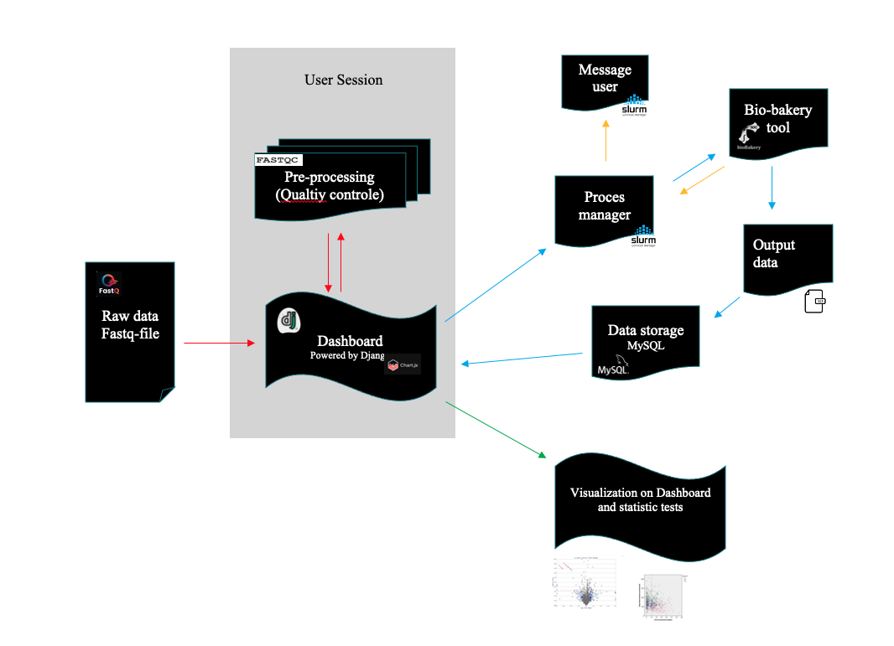

# BakedInBiobakery

*Figure1: Shows the functionality of the application. The different colored arrows show which processes belong together.*

### Introduction

Microorganisms are important for sustainable water technologies, and safety. Caenorhabditis elegans, for example, can be used to analyze the toxic potential of chemical pollutants in water (Karengera et al., 2022) [^1]. This is done by checking which genes are upregulated. Once it has been determined which genes have an increased expression. The metabolic pathways in which these genes are involved can be identified. Because Caenorhabditis elegans shares many genetic functions with mammals, including genes that influence the metabolism of xenobiotics. To identify these upregulated genes two main screening methods can be used: microarrays and RNA-seq. This latter is a based on next generation sequencing and if often referred to as transcriptome profiling.  

RNA-seq became popular a decade later than microarrays and is part of the next generation sequencing technologies that have arisen. It offers an advantage over microarrays by a lack of pre-selecting genes of interest, and instead, total RNA sequencing determines all the transcribed RNA are present in each sample at the moment of sampling. RNA-seq is more useful than microarrays for measuring transcript abundance, identifying transcripts, to improve annotation of genes, and de novo transcript assembly (Pevsner, 2015, p. 479)[^2]. As stated earlier, in the context of a research center focused on water quality, water safety and sustainability, it is interesting to determine which microbial processes are at play in water. This can be in the scope of constructing a phylogenic tree or active metabolic pathways and their influence on important processes in water technology or water safety. Since there is increasing interest among people in using transcriptomics, it would be great if these tools are available in a way that makes them more accessible. To researchers with a wide variety of backgrounds, ranging from biologists to chemical engineers without biology backgrounds nor trained in programming languages, it would be beneficial if analytical tools could be easily used via access to a graphical interface that supports an analytical pipeline. The best method of doing this is by creating a Web User Interface or WUI. This approach can be easily made user friendly, in combination with a complete and easy to understand manual about the workings of the implemented code from the bio-bakery. In this way most of the perceived goals can be accomplished. On the other hand, this is also the most difficult path to take. Because for this path to be truly effective the combination of frameworks and programming languages must be written in a regulated manner. This will make maintenance and expanding possible.

In this project, I am using existing software to build a user-friendly pipeline with great flexibility to visualize and analyze the data through a graphical user interface. This combination will make it easy for people without training or knowledge in computer languages to use the bio-bakery tools. Also, this application must be easy to expand up on. So that, for example, useful tools can be added and then they can be used by everyone.

### Usage

**Not User Ready.**

[^1]: Karengera, A., Sterken, M. G., Kammenga, J. E., Riksen, J. A. G., Dinkla, I. J. T., & Murk, A. J. (2022). Differential expression of genes in c. elegans reveals transcriptional responses to indirect-acting xenobiotic compounds and insensitivity to 2,3,7,8-tetrachlorodibenzodioxin. Ecotoxicology and Environmental Safety, 233. https://doi.org/10.1016/j.ecoenv.2022.113344

[^2]: Pevsner, J. (2015). Bioinformatics and Functional Genomics. Third Edition. In Briefings in Functional Genomics and Proteomics.