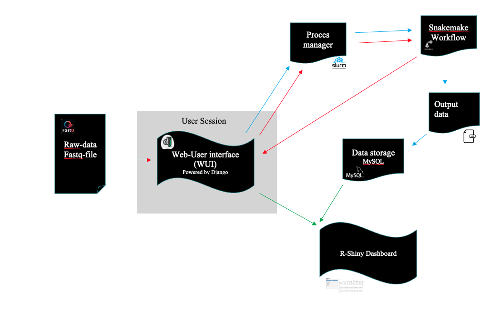

# BakedInBiobakery


*Figure1: Shows the functionality of the application. The different colored arrows show which processes belong together.*

## Intent

The Biobakery is a tool package that facilitates the analysis of transcriptome data (Beghini et al., 2021)[^1]. Transcriptome data shows which genes are active, and to what extent these genes are active at the time of measurement (Pevsner, 2015, p. 479) [^2]. By doing this for multiple samples of interest, it is possible to see if there are changes or differences in gene expression. When there are changes in an environment, genes can be up- or down regulated. If this is done in a controlled environment, the changes in gene expression can be related to the changes in the environment. In this way, the influence of substances on organisms in an environment can be investigated. 
 
The Biobakery is made for use in a non-graphical environment as shown in Figure1. For the average user, this is not advantageous in terms of usability. Therefore, it is common for students and even for professionals not to use these tools. 
To help encourage more people to work with these tools, the idea was conceived to create an usable application around them as shown in Figure2. The purpose of this application is not only to run the tools, but also to store the output data in a smart, easy-to-access and easy-to-interpret way.


## Usage

### 1) Getting it on your computer
**Not User Ready.**

First clone the both the BakedinBiobakery and the SnakePipeMultiHumaNn set the SnakePipeMultiHumaNn in the `biobakery/appModels` directory : 
```
 $ git clone https://github.com/GitMasterBart/BakedInBiobakery.git
 $ cd biobakery/appModels 
 $ git clone https://github.com/GitMasterBart/SnakePipeMultiHumaNn.git
 ```

### 2) Make it work

#### 2.1) Packages

Now create a virtual enviorement (venv/conda). And install
all the following packages. 

```
$ pip install [package]
```
or 

```
$ conda install [package]
```

**For running django:**
* Django
* pymsql

**Used for the biobakery snakefile-pipeline:** 
* human
* kneaddata
* bowtie2 

If it does not work to get bowtie on your system, use:

*For linux:*
``
sudo apt-get install bowtie 
``

*For mac:*
``su apt-get install bowtie``

#### 2.2) Pathways

Go to the file `Patways.py`. This file contains al the packages that are used in this application. 
Set all the pathways to the location of the file that is asked for. Example: 
```python
# html script example
LOCATIONBASHSCRIPTHUMAN = "[PATH_TO_PROJECT]/BakedInBiobakery/static/sh_scripts/HumanBashStarter.sh"

# database example
LOCATIONUNIREFFPULLDATABASE = "homes/user/database_map/unirefdatabase"
```

*Bibliografie:*

[^1]: Beghini, F., McIver, L. J., Blanco-Míguez, A., Dubois, L., Asnicar, F., Maharjan, S., Mailyan, A., Manghi, P., Scholz, M., Thomas, A. M., Valles-Colomer, M., Weingart, G., Zhang, Y., Zolfo, M., Huttenhower, C., Franzosa, E. A., & Segata, N. (2021). Integrating taxonomic, functional, and strain-level profiling of diverse microbial communities with biobakery 3. ELife, 10. https://doi.org/10.7554/eLife.65088

[^2]: Pevsner, J. (2015). Bsioinformatics and Functional Genomics. Third Edition. In Briefings in Functional Genomics and Proteomics.